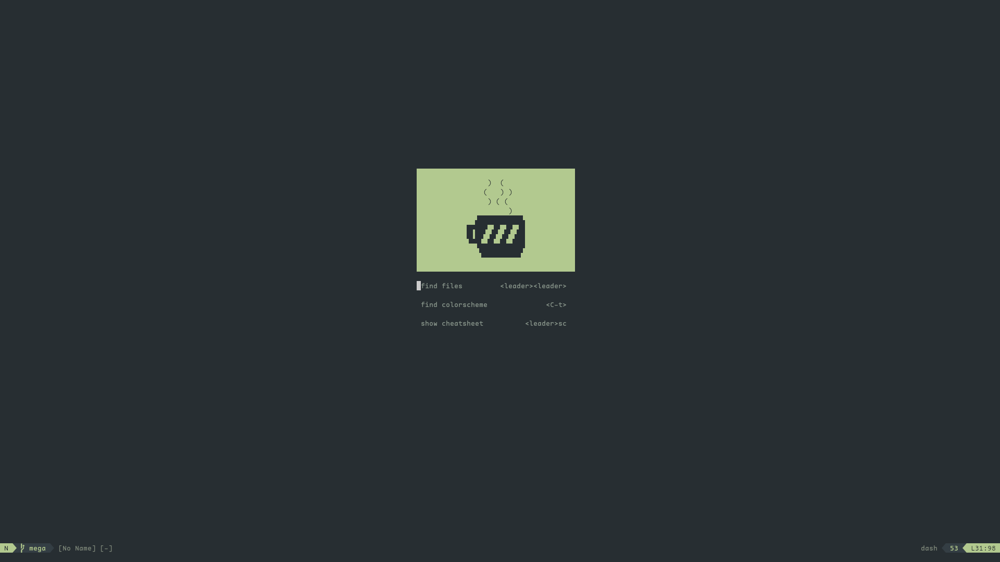
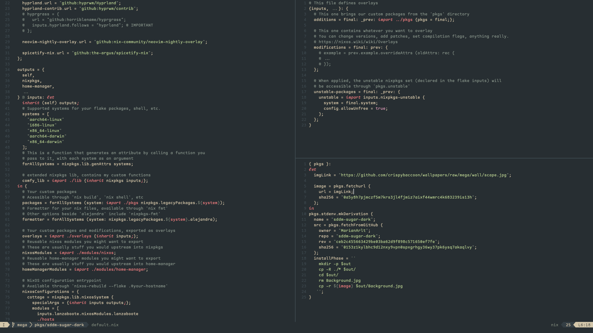

# chaivim

:tea: easily configurable neovim system with solid defaults and a cozy editor experience.




## :sparkles: Features

### Lazy plugin management

chaivim uses [lazy.nvim](https://github.com/folke/lazy.nvim) to manage plugins.

### integrated plugins

- :telescope: [telescope](https://github.com/nvim-telescope/telescope.nvim)
- :evergreen_tree: [treesitter](https://github.com/nvim-treesitter/nvim-treesitter)
- :computer: [keymaps](https://github.com/crispybaccoon/keymaps.nvim)
- :airplane: [lualine](https://github.com/nvim-lualine/lualine.nvim)
- :pencil: [cmp](https://github.com/hrsh7th/nvim-cmp)
- :scissors: [luasnip](https://github.com/L3MON4D3/LuaSnip)
- :hammer: [mini.nvim](https://github.com/echasnovski/mini.nvim)
- :vertical_traffic_light: [gitsigns](https://github.com/lewis6991/gitsigns.nvim)

## :lock: requirements

- Neovim >= 0.8.0 (needs to be built with LuaJIT)
- git >= 2.19.0 (for partial clones support)
- a Nerd Font (optional)

## :package: installation

chaivim can be installed [manually](#manual-install) or through the installer:
```shell
curl -fsSL https://github.com/CrispyBaccoon/chaivim/raw/mega/utils/installer/install.sh | sh
```

### manual install

```lua
-- init.lua
local rootpath = vim.fn.stdpath("data") .. "/core"
local chaipath = rootpath .. "/chai"

if not vim.loop.fs_stat(chaipath) then
  vim.system({
    "git",
    "clone",
    "--filter=blob:none",
    "https://github.com/crispybaccoon/chaivim.git",
    chaipath,
  }):wait()
end

vim.opt.rtp:prepend(chaipath)
```

## :rocket: usage

```lua
-- init.lua
require 'core'.setup {
    colorscheme = 'evergarden',
    transparent_background = false,
    modules = {
        core = {
            {
                'options',
                opts = {
                    cursorline = false,
                    tab_width = 2,
                    scrolloff = 5,
                },
            },
            {
                'dash',
                opts = {
                    open_on_startup = true,
                },
            },
        },
        custom = {
            -- your custom modules (in `lua/custom/`)
        },
    }
}
```
or call `require 'core'.setup 'custom'` to load a custom configuration from `lua/custom/init.lua`:
```lua
-- init.lua
require 'core'.setup 'custom'

-- lua/custom/init.lua
return {
    colorscheme = 'evergarden',
    modules = {
        core = {
            { 'options' },
            { 'base' },
        },
    }
}
```

all config fields can be overwritten after `setup()`:
```lua
core.config.colorscheme = 'tokyonight'
```

## :gear: config modules

view example configurations for modules [here](doc/modules.md).

## :camera: screenshots


