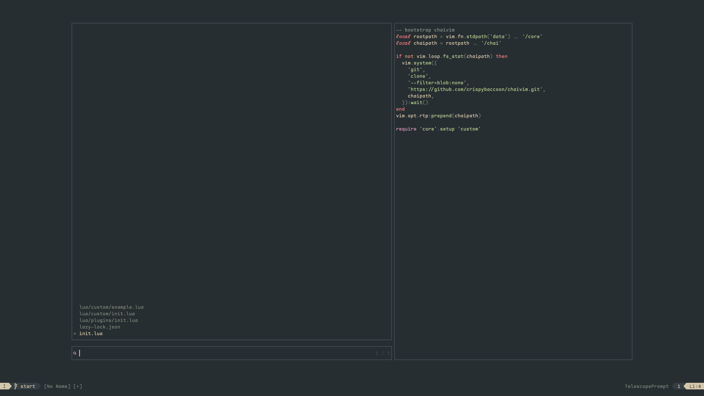

# chaivim



## :sparkles: Features

### Lazy plugin management

chaivim uses [lazy.nvim](https://github.com/folke/lazy.nvim) to manage plugins.

### integrated plugins

- :telescope: [telescope](https://github.com/nvim-telescope/telescope.nvim)
- :evergreen_tree: [treesitter](https://github.com/nvim-treesitter/nvim-treesitter)

## :lock: requirements

- Neovim >= 0.8.0 (needs to be built with LuaJIT)
- git >= 2.19.0 (for partial clones support)
- a Nerd Font (optional)

## :package: installation

chaivim can be installed [manually](#manual-install) or through the installer:
```shell
curl -fsSL https://github.com/CrispyBaccoon/chaivim/raw/mega/utils/installer/install.sh | sh
```

### manual install

```lua
-- init.lua
local rootpath = vim.fn.stdpath("data") .. "/core"
local chaipath = rootpath .. "/chai"

if not vim.loop.fs_stat(chaipath) then
  vim.system({
    "git",
    "clone",
    "--filter=blob:none",
    "https://github.com/crispybaccoon/chaivim.git",
    chaipath,
  }):wait()
end

vim.opt.rtp:prepend(chaipath)
```

## :rocket: usage

```lua
-- init.lua
require 'core'.setup {
    colorscheme = 'evergarden',
    transparent_background = false,
    modules = {
        core = {
            {
                'options',
                opts = {
                    cursorline = false,
                    tab_width = 2,
                    scrolloff = 5,
                },
            },
            {
                'dash',
                opts = {
                    open_on_startup = true,
                },
            },
        },
        custom = {
            -- your custom modules (in `lua/custom/`)
        },
    }
}
```
or call `require 'core'.setup 'custom'` to load a custom configuration from `lua/custom/init.lua`:
```lua
-- init.lua
require 'core'.setup 'custom'

-- lua/custom/init.lua
return {
    colorscheme = 'evergarden',
    modules = {
        core = {
            { 'options' },
            { 'base' },
        },
    }
}
```

all config fields can be overwritten after `setup()`:
```lua
core.config.colorscheme = 'tokyonight'
```

## :gear: config modules

### `options` module

```lua
{
  'options',
  event = nil,
  opts = {
    cursorline = false,
    tab_width = 2,
    scrolloff = 5,
    use_ripgrep = true,
    treesitter_folds = false,
  }
}
```

### `base` module

```lua
{
  'base',
  event = nil,
  opts = {
    -- `file_associations` can be used to set options for specific filetypes or
    --  setup a custom environment when opening a specific file
    file_associations = {
      { { '*.vim', '*.md' }, 'Remove line numbers', function()
        vim.opt_local.number = false
      end },
      { { '*.vto', '*.njk' }, '[Template Engine] set filetype html', function()
        vim.bo.filetype = 'html'
      end },
      { { '*' }, 'Use `q` to quit qf list', function(opts)
        if vim.bo[opts.buf].filetype == 'qf' then
          vim.keymap.set('n', 'q', ':quit<cr>', { buffer = opts.buf })
        end
      end },
    },
  }
}
```

### `highlights` module

```lua
{
  'highlights',
  event = 'UIEnter',
  opts = {
    -- `fix()` is run every time the colorscheme is changed
    -- it can be used to override some hightlights or create custom hightlights
    fix = function()
      vim.cmd [[ hi clear SpellCap ]]

      if vim.g.neovide then
        local alpha = function()
          return string.format("%x", math.floor(255 * vim.g.transparency or 0.0))
        end
        local bg_color = '#' .. vim.api.nvim_get_hl(0, { name = 'Normal' }).bg

        vim.g.neovide_background_color = bg_color .. alpha()
      end

      -- notes

      local groups = {
        fixme   = { "Fixme", vim.api.nvim_get_hl(0, { name = "DiagnosticWarn" }) },
        todo    = { "Todo", vim.api.nvim_get_hl(0, { name = "DiagnosticInfo" }) },
        note    = { "Note", vim.api.nvim_get_hl(0, { name = "DiagnosticHint" }) },
        success = { "Success", vim.api.nvim_get_hl(0, { name = "DiagnosticOk" }) },
        failure = { "Failure", vim.api.nvim_get_hl(0, { name = "DiagnosticError" }) },
      }
      for _, v in pairs(groups) do
        vim.api.nvim_set_hl(0, v[1], { fg = v[2].fg })
        vim.api.nvim_set_hl(0, v[1] .. 'Note', { fg = v[2].fg, reverse = true })
      end
    end
  },
}
```

### `dash` module

```lua
{
  'dash',
  opts = {
    -- when set to true, the dashboard will open on startup when the current buffer is empty
    open_on_startup = true,
    -- use custom ascii art
    header = {
      [[      )  (      ]],
      [[     (   ) )    ]],
      [[      ) ( (     ]],
      [[           )    ]],
      [[   ▟██████████▙ ]],
      [[ █▛██▛ ▟▛ ▟▛ ▟█ ]],
      [[ ▜▙█▛ ▟▛ ▟▛ ▟██ ]],
      [[   ▝██████████▛ ]],
      [[    ▝▀▀▀▀▀▀▀▀▀  ]],
    },
    buttons = {
      { 'find files', 'SPC SPC', function() require 'core.plugin.telescope'.picker.find_files {} end },
    },
  },
}
```

### `base16` module

```lua
{
  'base16',
  event = 'UIEnter',
  opts = {
    -- you can try out different colorschemes with `require 'core.plugin.base16'.select()`
    colorscheme = 'nord',
  },
}
```

## plugin modules

### `telescope` module

```lua
{
  'telescope',
  event = 'UIEnter',
  opts = {
    use_fzf = true,
    config = {}, -- `config` will be passed to `telescope.setup()`
  },
}
```

### `lazy` module

```lua
{
  'lua',
  event = nil,
  reload = false, -- lazy.nvim doesn't allow config reloading
}
```
